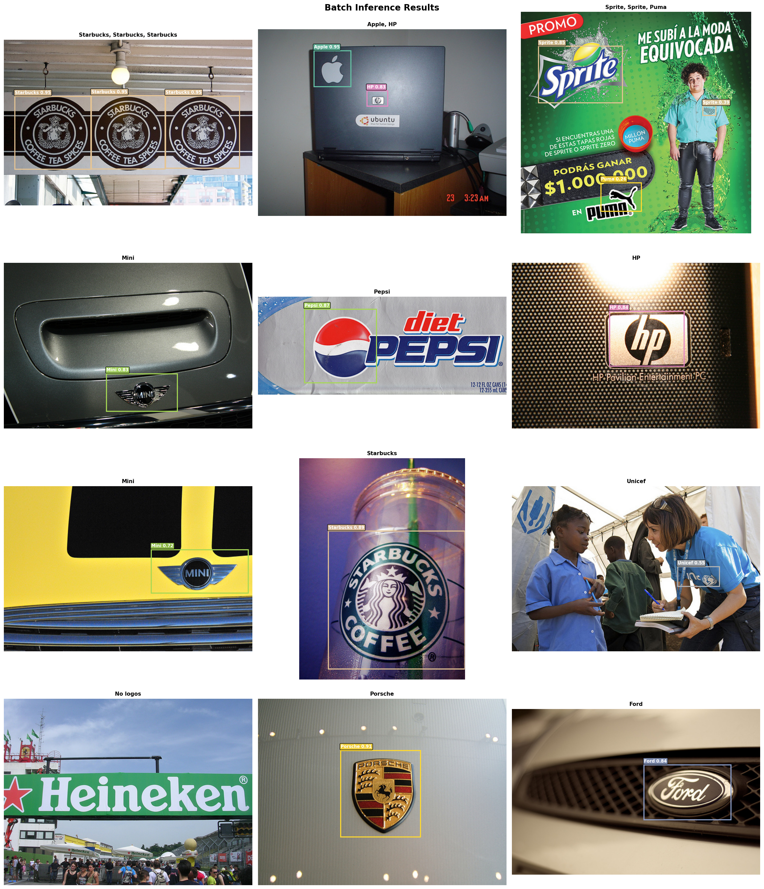
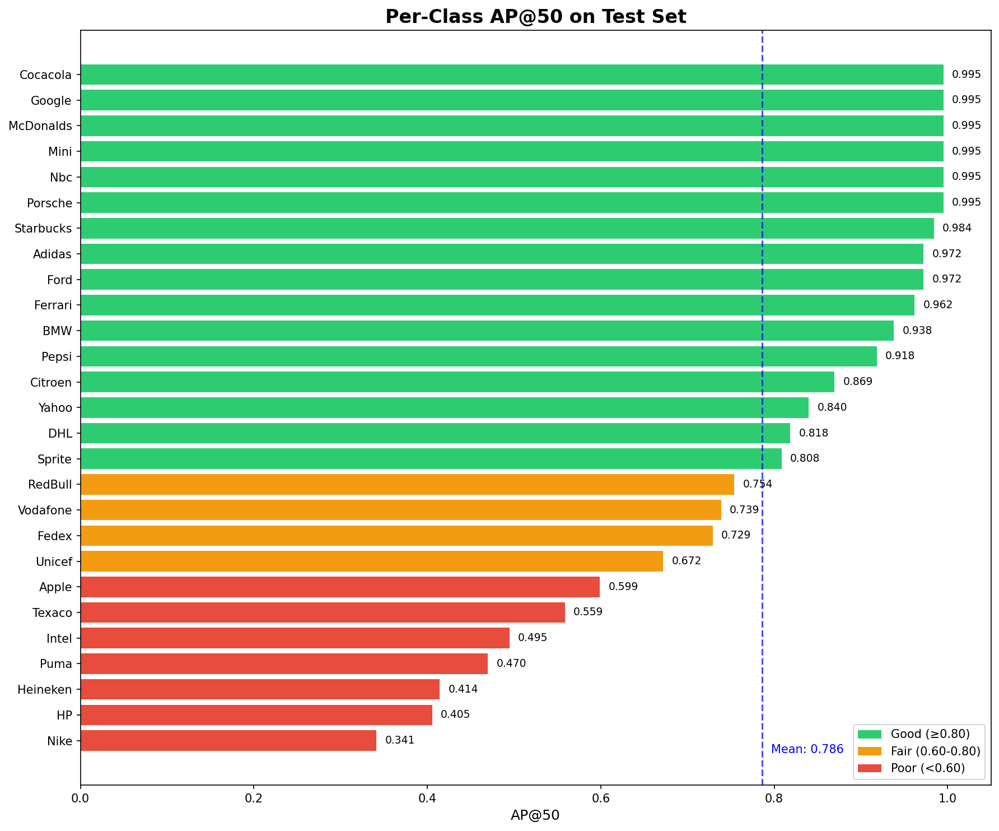
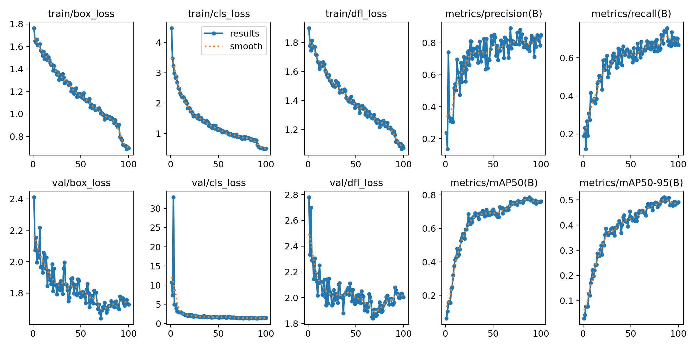
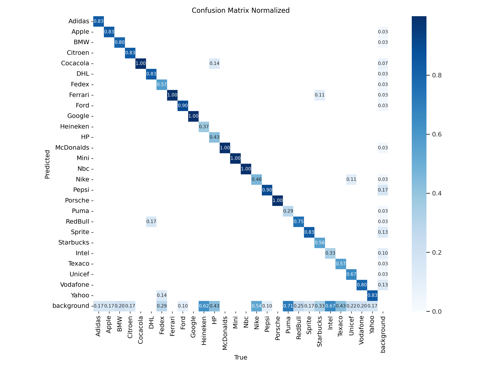
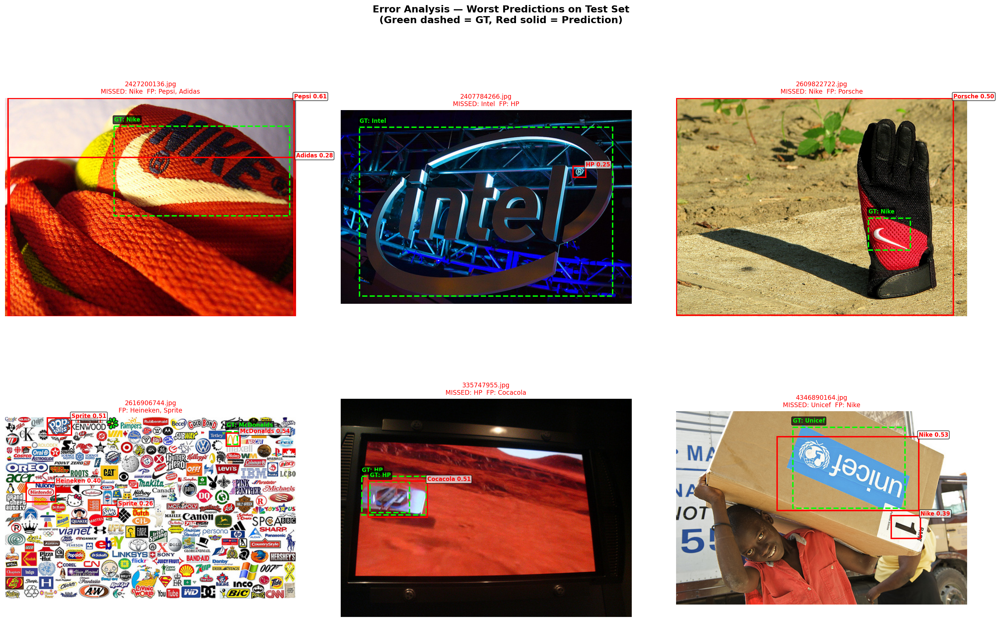

# 🔍 Brand Logo Detection with YOLOv8

Real-time detection and localization of **27 brand logos** in images using YOLOv8 object detection.



---

## 📋 Project Overview

| Item | Detail |
|------|--------|
| **Task** | Multi-Class Object Detection (27 classes) |
| **Model** | YOLOv8s (fine-tuned from COCO pretrained) |
| **Dataset** | Flickr Logos 27 — 808 images, 1,260 bounding boxes |
| **Framework** | Ultralytics 8.3.40, PyTorch 2.10.0 |
| **Training** | 100 epochs on Tesla T4 GPU (~23 min) |
| **Inference Speed** | ~15 ms/image (65.9 FPS) on Tesla T4 |

### Test Set Results

| Metric | Score |
|--------|-------|
| **mAP@50** | **78.6%** |
| **mAP@50-95** | **44.1%** |
| **Precision** | **81.9%** |
| **Recall** | **71.8%** |

---

## 🏷️ Detected Brands (27 Classes)

Adidas, Apple, BMW, Citroen, Coca-Cola, DHL, FedEx, Ferrari, Ford, Google, Heineken, HP, McDonald\'s, Mini, NBC, Nike, Pepsi, Porsche, Puma, Red Bull, Sprite, Starbucks, Intel, Texaco, Unicef, Vodafone, Yahoo

---

## 📊 Per-Class Performance



**Top performers (AP@50 > 95%):** Coca-Cola, Google, McDonald\'s, Mini, NBC, Porsche, Starbucks

**Challenging classes (AP@50 < 50%):** Nike (34.1%), HP (40.5%), Heineken (41.4%), Puma (47.0%), Intel (49.5%)

---

## 🏗️ Architecture
```
YOLOv8s (Small)
├── Backbone: CSPDarknet with C2f modules
├── Neck: FPN + PAN (Feature Pyramid Network)
├── Head: Decoupled anchor-free detection head
├── Parameters: 11.1M
├── GFLOPs: 28.5
└── Input: 640×640 RGB
```

### Training Strategy
- **Pretrained weights**: COCO-pretrained YOLOv8s
- **Optimizer**: AdamW (lr=0.001, weight_decay=0.0005)
- **Scheduler**: Linear warmup (3 epochs) + cosine decay
- **Augmentation**: Mosaic, MixUp, HSV jitter, horizontal flip, scale, translate
- **Early stopping**: Patience=15 (best at epoch 85)

---

## 📈 Training Curves



---

## 🔍 Error Analysis





**Key findings:**
- 73.3% of test images are predicted perfectly
- Main failure modes: small logos, unusual viewpoints, and visually similar brands
- Vodafone and Nike struggle due to high intra-class variation in the dataset

---

## 📁 Project Structure
```
brand-logo-detection/
├── src/
│   ├── config.py          # All project settings & hyperparameters
│   ├── prepare_data.py    # Download, parse, convert to YOLO format
│   ├── eda.py             # Exploratory data analysis & visualization
│   ├── train.py           # YOLOv8 fine-tuning pipeline
│   ├── evaluate.py        # Test set evaluation & error analysis
│   └── predict.py         # Inference on new images
├── data/
│   ├── raw/               # Original Flickr Logos 27 dataset
│   └── processed/         # YOLO-format images & labels (train/val/test)
├── outputs/
│   ├── figures/           # All charts and visualizations
│   ├── models/            # Trained model weights (best.pt)
│   └── predictions/       # Test metrics JSON
├── runs/                  # YOLO training & evaluation logs
├── dataset.yaml           # YOLO dataset configuration
├── .gitignore
└── README.md
```

---

## 🚀 Quick Start

### 1. Setup Environment
```bash
pip install ultralytics==8.3.40
```

### 2. Prepare Data
```python
# Configure Kaggle API credentials first
python src/prepare_data.py
```

### 3. Train
```python
python src/train.py
```

### 4. Evaluate
```python
python src/evaluate.py
```

### 5. Inference
```python
from src.predict import load_model, predict_single, visualize_prediction

model = load_model("outputs/models/best.pt")
results, detections = predict_single(model, "path/to/image.jpg")
visualize_prediction("path/to/image.jpg", detections)
```

---

## 🛠️ Tech Stack

- **Deep Learning**: PyTorch 2.10.0, Ultralytics YOLOv8
- **Computer Vision**: OpenCV
- **Data Processing**: NumPy, Pandas
- **Visualization**: Matplotlib
- **Environment**: Google Colab (Tesla T4 GPU)

---

## 📚 Dataset

**Flickr Logos 27** — an annotated logo dataset from Flickr containing 27 brand logo classes.

- **Source**: [Kaggle](https://www.kaggle.com/datasets/sushovansaha9/flickr-logos-27-dataset)
- **Original paper**: Kalantidis et al., "Scalable Triangulation-based Logo Recognition" (ICMR 2011)
- **Split**: 565 train / 108 val / 135 test images

---

## 📄 License

This project is for educational and portfolio purposes. The Flickr Logos 27 dataset is subject to its original terms of use.
